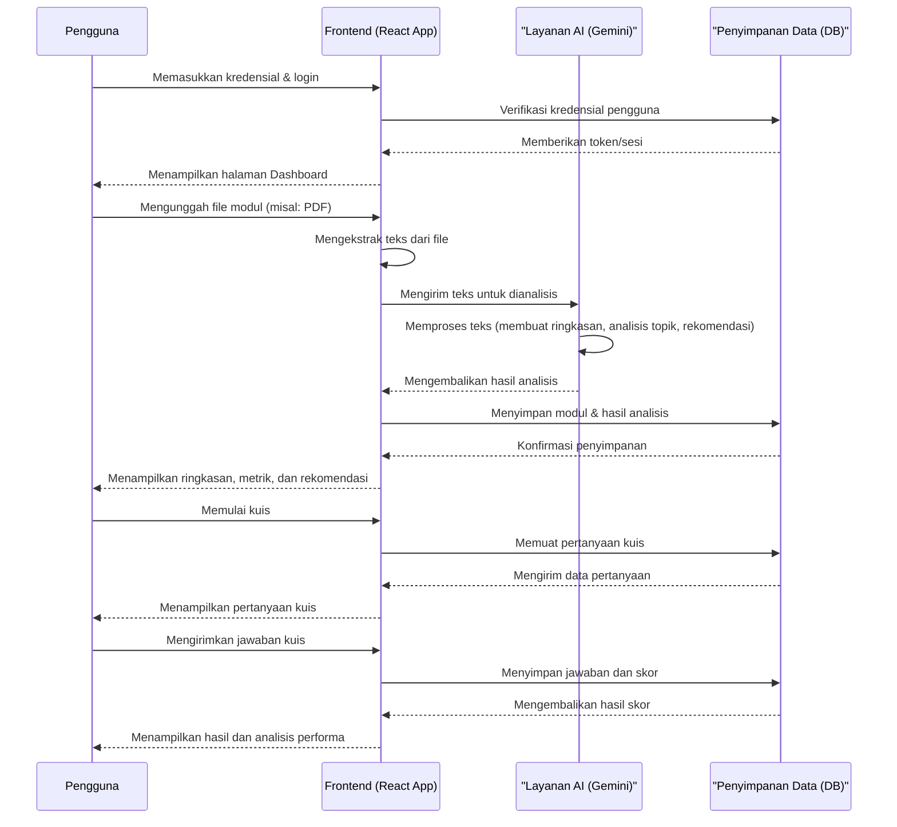

# Diagram Alur Data (DAD) - Sistem ELARA

Dokumen ini menjelaskan alur data dan interaksi antara berbagai komponen dalam sistem ELARA (E-Learning Analytics and Recommendation Application).

## Entitas Utama

1.  **Pengguna (User)**: Mahasiswa atau pembelajar yang berinteraksi dengan sistem.
2.  **Aplikasi Frontend (React)**: Antarmuka pengguna (UI) yang berjalan di browser, tempat pengguna berinteraksi langsung.
3.  **Layanan AI (Gemini AI Service)**: Layanan kecerdasan buatan yang bertanggung jawab untuk menganalisis konten, membuat ringkasan, dan memberikan rekomendasi.
4.  **Penyimpanan Data (Data Store)**: Basis data atau sistem penyimpanan untuk menyimpan data pengguna, modul, analisis, dan data relevan lainnya.

## Diagram Alur Data (Level Kontekstual)

Diagram berikut memvisualisasikan alur interaksi dan data antara pengguna, aplikasi frontend, dan layanan pendukung dalam sistem ELARA.

## Deskripsi Proses Alur Data

### 1. Proses Autentikasi
- **Input**: Kredensial (username/password) dari **Pengguna**.
- **Proses**: **Aplikasi Frontend** mengirimkan kredensial ke **Penyimpanan Data** untuk verifikasi. Jika berhasil, sesi pengguna dibuat.
- **Output**: Tampilan halaman utama (dashboard) kepada **Pengguna**.

### 2. Proses Unggah dan Analisis Modul
- **Input**: File modul pembelajaran (misalnya PDF) dari **Pengguna**.
- **Proses**:
    1.  **Aplikasi Frontend** menerima file dan menggunakan utilitas (`fileExtractor.js`, `pdfLoader.js`) untuk mengekstrak konten teks.
    2.  Teks yang diekstrak dikirim ke **Layanan AI (Gemini)** melalui `aiService.js`.
    3.  **Layanan AI** menghasilkan ringkasan, analisis sentimen/topik, dan rekomendasi belajar.
    4.  Hasil analisis dikirim kembali ke **Aplikasi Frontend**.
    5.  **Aplikasi Frontend** menampilkan data ini kepada pengguna melalui komponen seperti `AISummaryDisplay` dan `AIRecommendations`, serta menyimpannya ke **Penyimpanan Data**.
- **Output**: Visualisasi ringkasan, metrik efektivitas, dan rekomendasi pembelajaran untuk **Pengguna**.

### 3. Proses Pengerjaan Kuis
- **Input**: Jawaban kuis dari **Pengguna**.
- **Proses**:
    1.  **Aplikasi Frontend** mengambil data pertanyaan dari **Penyimpanan Data**.
    2.  Setelah pengguna menyelesaikan kuis, jawaban dikirim dan dievaluasi.
    3.  Skor dan data analitik (waktu pengerjaan, jawaban benar/salah) disimpan di **Penyimpanan Data** dan dikaitkan dengan profil **Pengguna**.
- **Output**: Tampilan skor, umpan balik, dan pembaruan metrik kemajuan belajar (`LearningAnalyticsDisplay`) kepada **Pengguna**.

### 4. Proses Interaksi dengan Chatbot
- **Input**: Pertanyaan atau prompt dari **Pengguna** melalui komponen `Chatbot.js`.
- **Proses**: **Aplikasi Frontend** mengirimkan input pengguna ke **Layanan AI (Gemini)** untuk mendapatkan respons yang relevan secara kontekstual.
- **Output**: Jawaban yang dihasilkan oleh AI ditampilkan kepada **Pengguna** di antarmuka chatbot.
