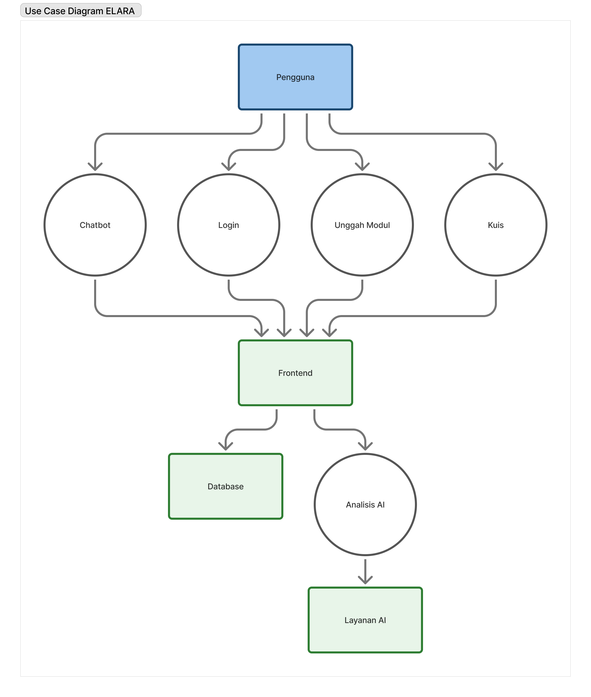
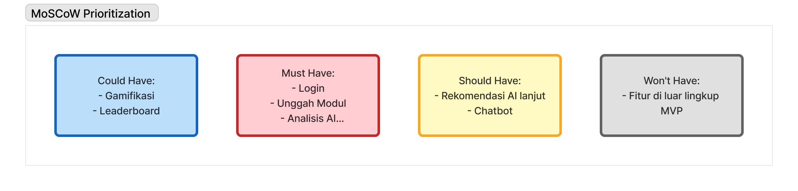
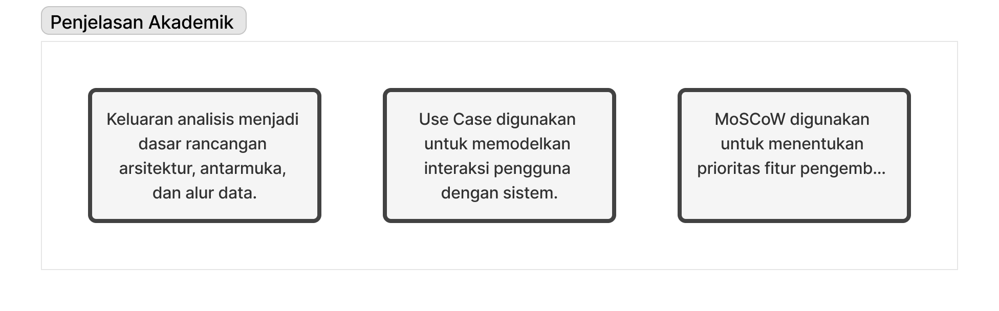

BAB III METODOLOGI

3.1.	Metode Penelitian
Metode penelitian yang digunakan adalah Research and Development (R&D) untuk merancang, membangun, dan mengevaluasi aplikasi ELARA (E-Learning and Adaptive Recommendation Application).

Populasi dan Sampel
-	Populasi: Mahasiswa yang menggunakan platform pembelajaran digital (E-Learning).
-	Sampel: Penelitian awal ini menggunakan sampel terbatas yang terdiri dari 4 orang anggota tim pengembang.

*Catatan Keterbatasan*: Disadari bahwa sampel ini tidak representatif terhadap populasi mahasiswa Universitas Terbuka (UT) secara umum, sehingga data yang diperoleh pada tahap awal ini tidak dapat digeneralisasi. Penelitian ini lebih berfokus pada studi kelayakan teknis dan pengumpulan umpan balik formatif untuk pengembangan awal. Untuk validasi yang lebih kuat, penelitian selanjutnya akan memerlukan sampel yang lebih besar dan beragam dari populasi target.

3.1.1	Teknik Pengumpulan Data
Data dikumpulkan melalui beberapa teknik untuk memastikan pemahaman yang komprehensif terhadap kebutuhan sistem:
1.	Wawancara: Wawancara semi-terstruktur dengan sampel untuk menggali pengalaman, kesulitan, dan ekspektasi terhadap platform E-Learning.
2.	Observasi: Mengamati interaksi sampel dengan platform E-Learning yang ada untuk mengidentifikasi tantangan dan pola penggunaan.
3.	Studi Pustaka: Mengkaji literatur ilmiah terkait sistem pembelajaran adaptif, NLP, dan teknologi relevan lainnya.

3.2 	Proses Analisis
3.2.1	Proses Analisis Kebutuhan
Analisis kebutuhan dilakukan dengan metode analisis kualitatif terhadap data yang terkumpul dari wawancara dan observasi. Kebutuhan fungsional dan non-fungsional diidentifikasi dengan mentranskripsikan hasil wawancara dan rekaman observasi, kemudian dilakukan *thematic analysis* untuk mengelompokkan umpan balik ke dalam tema-tema utama, seperti "kesulitan navigasi," "kebutuhan rangkuman cepat," dan "keinginan untuk latihan yang adaptif." Tema-tema ini kemudian menjadi dasar perancangan fitur-fitur utama ELARA.

3.2.2	Diagram Alur Data Sistem
Diagram berikut memvisualisasikan alur interaksi dan data dalam sistem ELARA.
*(Catatan: Diagram alir disajikan dalam resolusi rendah. Versi resolusi tinggi akan tersedia dalam dokumentasi teknis terpisah).*

    
    
    

3.3. 	Proses Perancangan
Proses perancangan sistem ELARA mengadopsi pendekatan *User-Centered Design* (UCD) yang berfokus pada kebutuhan dan pengalaman pengguna akhir.

3.3.1	Arsitektur Sistem
Aplikasi ini dirancang dengan arsitektur *Component-Based* pada sisi frontend menggunakan React. Arsitektur ini memisahkan antarmuka pengguna menjadi komponen-komponen independen dan dapat digunakan kembali (misalnya, `PDFViewer`, `QuizPage`, `Dashboard`). Secara konseptual, arsitektur ini mengikuti pola Model-View-Controller (MVC) di mana:
-	**Model**: Dikelola di sisi klien, merepresentasikan data seperti status pengguna, konten modul, dan skor kuis.
-	**View**: Dirender oleh komponen React yang menyajikan data kepada pengguna.
-	**Controller**: Logika bisnis yang terkandung dalam fungsi dan *event handler* di dalam komponen, yang mengelola interaksi pengguna dan pembaruan state.

3.3.2	Desain Antarmuka (UI/UX)
Desain UI/UX dikembangkan menggunakan **Figma**. Proses ini mencakup pembuatan *wireframe* untuk tata letak dasar dan *mockup* resolusi tinggi untuk visualisasi antarmuka akhir. Fokus desain adalah menciptakan pengalaman pengguna yang intuitif, modern, dan mudah diakses.
*(Catatan: Contoh mockup dan skema desain akan dilampirkan dalam dokumentasi perancangan).*

3.3.3	Spesifikasi Teknis dan Teknologi
Pemilihan teknologi didasarkan pada kebutuhan untuk membangun aplikasi web modern yang interaktif, responsif, dan cerdas.
-	**React.js**: Dipilih sebagai *library* frontend karena ekosistemnya yang matang dan kemampuannya membangun *Single Page Application* (SPA) yang cepat. Arsitektur berbasis komponennya mempercepat pengembangan dan pemeliharaan.
-	**Tailwind CSS**: Dipilih untuk mempercepat proses styling dengan pendekatan *utility-first*, memungkinkan pembuatan desain kustom yang konsisten tanpa meninggalkan HTML/JSX.
-	**Node.js & NPM**: Digunakan sebagai lingkungan pengembangan untuk manajemen dependensi, menjalankan *development server*, dan proses *build* aplikasi.
-	**Google Gemini API**: Dipilih karena kemampuannya dalam pemrosesan bahasa alami (NLP) yang canggih untuk menganalisis konten PDF dan menghasilkan rangkuman serta rekomendasi secara dinamis.
-	**MySQL (Direncanakan)**: Untuk versi produksi penuh, database relasional seperti MySQL akan digunakan untuk menyimpan data pengguna, progres belajar, dan konten modul secara persisten.

3.4.	Implementasi
Pengembangan sistem menggunakan metodologi *Agile* dengan pendekatan iteratif. Tim bekerja dalam siklus pendek untuk mengimplementasikan fitur, menguji, dan melakukan perbaikan secara berkelanjutan.

3.4.1	Lingkungan Implementasi
-	**Lingkungan Pengembangan**: Node.js v18+, dengan `create-react-app` sebagai *toolchain*.
-	**Lingkungan Produksi**: Aplikasi di-*build* sebagai aset statis (HTML, CSS, JS) yang dapat di-*deploy* di berbagai layanan *hosting* web.

3.4.2	Fitur yang Berhasil Diimplementasikan
Versi prototipe ini mencakup fitur-fitur inti berikut:
-	**Manajemen Modul**: Pengguna dapat mengunggah dokumen PDF.
-	**Rangkuman AI**: Sistem secara otomatis menghasilkan rangkuman dari konten PDF menggunakan Gemini AI.
-	**Rekomendasi Topik**: Sistem memberikan rekomendasi topik terkait berdasarkan analisis konten.
-	**Kuis Adaptif**: Sistem dapat menyajikan halaman kuis (fungsionalitas adaptif dalam pengembangan).
-	**Dashboard Analitik**: Menampilkan metrik pembelajaran seperti skor rata-rata dan progres.

3.4.3	Jadwal Implementasi
*(Catatan: Jadwal implementasi detail yang mencakup setiap fase dari perancangan hingga pengujian akan disajikan dalam dokumen manajemen proyek terpisah).*

3.5.	Pengujian dan Evaluasi
Proses pengujian dan evaluasi dirancang untuk memvalidasi fungsionalitas, usabilitas, dan efektivitas sistem.

3.5.1	Metode Pengujian
-	**Black Box Testing**: Menguji fungsionalitas sistem dari perspektif pengguna tanpa melihat kode internal. Pengujian mencakup alur unggah modul, generasi rangkuman, hingga pengerjaan kuis.
-	**Usability Testing**: Menggunakan metode *Thinking Aloud*, di mana pengguna diminta untuk menyuarakan pikiran mereka saat berinteraksi dengan aplikasi. Ini bertujuan untuk mengidentifikasi masalah usabilitas dan kebingungan pada alur pengguna.

3.5.2	Kriteria Keberhasilan (Sukses)
Kriteria sukses yang terukur telah didefinisikan untuk mengevaluasi sistem:
-	**Akurasi Rekomendasi**: Akurasi > 80% dalam memberikan rekomendasi topik yang relevan (diukur melalui penilaian ahli atau umpan balik pengguna).
-	**Waktu Respons Sistem**: Waktu untuk menghasilkan rangkuman AI < 5 detik untuk dokumen berukuran standar.
-	**Tingkat Kepuasan Pengguna**: Skor kepuasan > 85% berdasarkan kuesioner (misalnya, System Usability Scale - SUS).

3.5.3	Sampel Pengujian
Pengujian awal dilakukan pada tim internal. Untuk evaluasi yang valid, pengujian selanjutnya akan melibatkan sampel mahasiswa dari populasi target untuk mendapatkan hasil yang lebih objektif.

3.5.4	Analisis Hasil Pengujian
-	**Analisis Kuantitatif**: Menganalisis data metrik seperti waktu respons, tingkat keberhasilan tugas, dan skor kuesioner.
-	**Analisis Kualitatif**: Menganalisis umpan balik verbal dari sesi *Thinking Aloud* untuk mengidentifikasi masalah usabilitas dan area perbaikan.

*Catatan Hasil*: Hasil pengujian kuantitatif dan kualitatif dari sampel target belum tersedia pada tahap ini. Evaluasi awal oleh tim pengembang digunakan untuk iterasi perbaikan prototipe. Hasil evaluasi formal akan disajikan setelah pengujian dengan sampel pengguna akhir selesai dilakukan.